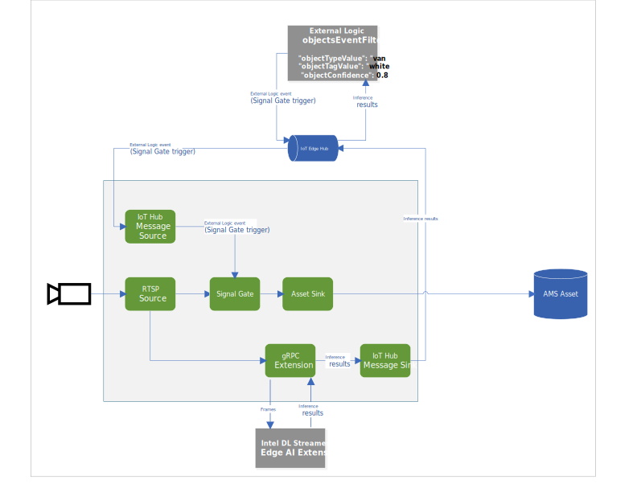

# objectsEventFilter
[Live video analytics on IoT Edge (LVA)](https://azure.microsoft.com/en-us/services/media-services/live-video-analytics/) is a new capability of Azure. LVA provides a platform for you to build intelligent video applications that span the edge and the cloud. The platform offers the capability to capture, record, analyze live video and publish the results (video and/or video analytics) to Azure services (in the cloud and/or the edge). The platform can be used to enhance IoT solutions with video analytics.

The objectsEventFilter module can be deployed to your IoT Edge device that runs the Live Video Analytics media graph and trigger a recording based on certain inference attributes. While it is written to work with inference results from the Intel DL Streamer - Edge AI Extension used in [this tutorial](https://docs.microsoft.com/azure/media-services/live-video-analytics-edge/use-intel-grpc-vas-tutorial) it can also be modified for use with any other AI module listed in https://github.com/Azure/live-video-analytics/tree/master/utilities/video-analysis/. This sample module is currently only tested to build for x64. Support for arm64 will come soon.

When you deploy this module and use the included deployment template and tolopology the media graph will look like this:


The first path is to a gRPC extension node. The node samples the video frames to a value set by you using the samplingOptions field and then relays the frames, as images, to the AI module DL Streamer - Edge AI Extension. The node receives the results, which are the objects (persons, vehicles and bikes) detected by the model, and additional attributes when using classification or tracking. The gRPC extension node then publishes the results via the IoT Hub message sink node to the IoT Edge hub.
The objectsEventFilter module is set up to receive messages from the IoT Edge hub, which include the object detection results (persons, vehicles and bikes). The module checks these messages and looks for objects of a certain type, specific attribute and confidence level which were configured via a setting in the deployment template. When such an object is found, this module sends a message to the IoT Edge hub. Those "object found" messages are then routed to the IoT Hub source node of the media graph. Upon receiving such a message, the IoT Hub source node in the media graph triggers the signal gate processor node. The signal gate processor node then opens for a configured amount of time. Video flows through the gate to the asset sink node for that duration. That portion of the live stream is then recorded via the asset sink node to an asset in your Azure Media Services account.

Sample Inference result:
```
{
      "type": "entity",
      "entity": {
        "tag": {
          "value": "vehicle",
          "confidence": 0.8907926
        },
        "attributes": [
          {
            "name": "color",
            "value": "white",
            "confidence": 0.8907926
          },
          {
            "name": "type",
            "value": "van",
            "confidence": 0.8907926
          }
        ],
        "box": {
          "l": 0.63165444,
          "t": 0.80648696,
          "w": 0.1736759,
          "h": 0.22395049
        }
 }

```

Sample attribute filter in the deployment template:
```
    "objectsEventFilter": {
      "properties.desired": {
        "objectTypeValue": "van",
        "objectTypeName": "type",
        "objectTagValue": "white",
        "objectTagName": "color",
        "objectConfidence": 0.8
      }
    }
```

Sample IoT Message that is emitted when the objectEventFilter Module has a match between the inference results and the specified filter objective in the deployment template:
```
[IoTHubMonitor] [2:05:28 PM] Message received from [nuclva20/objectsEventFilter]:
{
  "confidence": 0.8907926,
  "color": "white",
  "type": "van"
}
```

## How to prepare for deployment
1) Clone or download the contents of this repo to your development machine where you also have the [LVA tutorials repo](https://github.com/Azure-Samples/live-video-analytics-iot-edge-csharp) cloned
2) Copy/move the objectsEventFilter folder to the LVA folder live-video-analytics-iot-edge-csharp\src\edge\modules\

## Build the module image
The code sample shared here is needs to be converted into a docker image. This can be done using the same steps as with our [objectCounter module](https://docs.microsoft.com/azure/media-services/live-video-analytics-edge/event-based-video-recording-tutorial). Navigate to the objectsEventFilter folder in VS Code and follow [these steps](https://docs.microsoft.com/azure/media-services/live-video-analytics-edge/event-based-video-recording-tutorial#generate-and-deploy-the-iot-edge-deployment-manifest)

## Deploy the module
Now that you have the module pushed to your Azure Container Registry you can create a deployment manifest that will reference it and deploy it to your IoT Edge device. A sample template is included [here](./templates/deployment.objectsEventFilter.template.json). You can create a deployment manifest off of this template. There are a couple important things in this template.

The routing of IoT messages between the different IoT Modules are specified here:
```
"routes": {
          "ObjectsEventFilterToIoTHub": "FROM /messages/modules/objectsEventFilter/outputs/* INTO $upstream",
          "LVAToObjectsEventFilter": "FROM /messages/modules/lvaEdge/outputs/detectedObjects INTO BrokeredEndpoint(\"/modules/objectsEventFilter/inputs/detectedObjects\")",
          "LVADiagnosticsToIoTHub": "FROM /messages/modules/lvaEdge/outputs/AmsDiagnostics/* INTO $upstream",
          "LVAOperationalToIoTHub": "FROM /messages/modules/lvaEdge/outputs/AmsOperational/* INTO $upstream",
          "ObjectsEventFilterToLVA": "FROM /messages/modules/objectsEventFilter/outputs/objectsEventFilterTrigger INTO BrokeredEndpoint(\"/modules/lvaEdge/inputs/recordingTrigger\")"
}
```
"ObjectsEventFilterToIoTHub" : Will route the output messages from the objectsEventFilter module to the IoT hub.

"LVAToObjectsEventFilter" : Will route the output of the LVA Module containing the inference results to the objectsEventFilter module.

"LVADiagnosticsToIoTHub" : Will route telemetry events to IoT Hub.

"LVAOperationalToIoTHub" : Will route Azure Media Services messages to IoT Hub.

"ObjectsEventFilterToLVA" : Will route the output messages from the objectsEventFilter module to the LVA Module. This is the message after the filter has a match on the inference results. This message is the trigger for the Signal Gate node to open.


Pay attention to to the bottom part of the template. This is where you specify the attribute values and confidence level to trigger on.
```
"objectsEventFilter": {
     "properties.desired": {
       "objectTypeValue": "van",
       "objectTypeName": "type",
       "objectTagValue": "white",
       "objectTagName": "color",
       "objectConfidence": 0.8
     }
}
```


